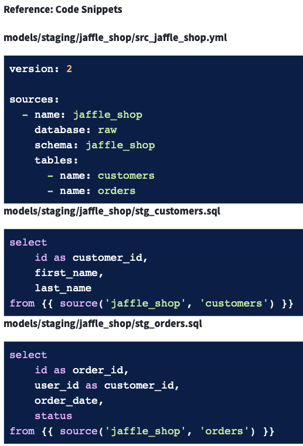
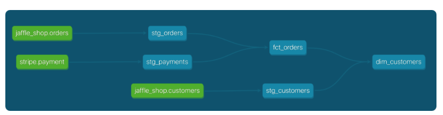

# Learning DBT

Course: <https://learn.getdbt.com/learn/course/dbt-fundamentals/welcome-to-dbt-fundamentals-5min/welcome>

Documentation: <https://docs.getdbt.com/>

## ETL and ELT

Extract transform load -> get data, transform it and load it into a new database that can then be queried by Data Analyst.

Dataware house combines database and supercomputer, because data can be transformed directly in the DW.

Therefore Extract, Load, Transform has become a new standard.

## Analytics Engineer

Taking raw data, and transforming it to BI.

Gives Data Engineer the time to Extract and Load and Data Analyst to work with the data after the transform.

| Data Engineer                                 | Analytics Engineer                                                           | Data Analysts            |
| --------------------------------------------- | ---------------------------------------------------------------------------- | ------------------------ |
| Build custom data ingestion integrations      | Provide clean, transformed data ready for analysis                           | Deep insights work       |
| Manage overall pipleine orchestration         | APply software engineering practices to analytics code                       | Work with business users |
| Develio and deploy machine learning endpoints | Maintain data docs and definitions                                           | Dashboards               |
| Build and maintain the data platform          | Train business users on how to use a data platform data visulatization tools | Forecasting              |
| DW performance optimization                   |                                                                              |                          |

## dbt in the modern data stack

dbt work directly on the data platform.

```bash
dbt run
```

Build does both run and test.

```bash
dbt build
```

## [build models on top of sources](https://docs.getdbt.com/guides/snowflake?step=11#build-models-on-top-of-sources)

```yaml
version: 2

sources:
    - name: jaffle_shop
      description: This is a replica of the Postgres database used by our app
      database: raw
      schema: jaffle_shop
      tables:
          - name: customers
            description: One record per customer.
          - name: orders
            description: One record per order. Includes cancelled and deleted orders.
```

```sql
select
    id as customer_id,
    first_name,
    last_name

from {{ source('jaffle_shop', 'customers') }}
```

```
dbt run
```

## Testing and docs

```yaml
version: 2

models:
  - name: customers
    description: One record per customer
    columns:
      - name: customer_id
        description: Primary key
        tests:
          - unique
          - not_null
      - name: first_order_date
        description: NULL when a customer has not yet placed an order.

  - name: stg_customers
    description: This model cleans up customer data
    columns:
      - name: customer_id
        description: Primary key
        tests:
          - unique
          - not_null

  - name: stg_orders
    description: This model cleans up order data
    columns:
      - name: order_id
        description: Primary key
        tests:
          - unique
          - not_null
      - name: status
        tests:
          - accepted_values:
              values: ['placed', 'shipped', 'completed', 'return_pending', 'returned']
      - name: customer_id
        tests:
          - not_null
          - relationships:
              to: ref('stg_customers')
              field: customer_id
```

```bash
dbt test
```

```bash
dbt docs generate
```

In the docs we can also see the lineage of the data.


## [Building your first model](https://learn.getdbt.com/learn/course/dbt-fundamentals/models-45min/building-your-first-model)

Review

**Models**

- Models are .sql files that live in the models folder.
- Models are simply written as select statements - there is no DDL/DML that needs to be written around this. This allows the developer to focus on the logic.
- In the Cloud IDE, the Preview button will run this select statement against your data warehouse. The results shown here are equivalent to what this model will return once it is materialized.
- After constructing a model, dbt run in the command line will actually materialize the models into the data warehouse. The default materialization is a view.
- The materialization can be configured as a table with the following configuration block at the top of the model file:

```sql
{{ config(
materialized='table'
) }}
```

- The same applies for configuring a model as a view:

```sql
{{ config(
materialized='view'
) }}
```

- When dbt run is executing, dbt is wrapping the select statement in the correct DDL/DML to build that model as a table/view. If that model already exists in the data warehouse, dbt will automatically drop that table or view before building the new database object. *Note: If you are on BigQuery, you may need to run dbt run --full-refresh for this to take effect.
- The DDL/DML that is being run to build each model can be viewed in the logs through the cloud interface or the target folder.

**Modularity**

- We could build each of our final models in a single model as we did with dim_customers, however with dbt we can create our final data products using modularity.
- Modularity is the degree to which a system's components may be separated and recombined, often with the benefit of flexibility and variety in use.
- This allows us to build data artifacts in logical steps.
- For example, we can stage the raw customers and orders data to shape it into what we want it to look like. Then we can build a model that references both of these to build the final dim_customers model.
- Thinking modularly is how software engineers build applications. Models can be leveraged to apply this modular thinking to analytics engineering.

**ref Macro**

- Models can be written to reference the underlying tables and views that were building the data warehouse (e.g. analytics.dbt_jsmith.stg_jaffle_shop_customers). This hard codes the table names and makes it difficult to share code between developers.
- The ref function allows us to build dependencies between models in a flexible way that can be shared in a common code base. The ref function compiles to the name of the database object as it has been created on the most recent execution of dbt run in the particular development environment. This is determined by the environment configuration that was set up when the project was created.
- Example: `{{ ref('stg_jaffle_shop_customers') }}` compiles to `analytics.dbt_jsmith.stg_jaffle_shop_customers`.
- The ref function also builds a lineage graph like the one shown below. dbt is able to determine dependencies between models and takes those into account to build models in the correct order.

**Modeling History**

- There have been multiple modeling paradigms since the advent of database technology. Many of these are classified as normalized modeling.
- Normalized modeling techniques were designed when storage was expensive and computational power was not as affordable as it is today.
- With a modern cloud-based data warehouse, we can approach analytics differently in an agile or ad hoc modeling technique. This is often referred to as denormalized modeling.
- dbt can build your data warehouse into any of these schemas. dbt is a tool for how to build these rather than enforcing what to build.

**Naming Conventions**

- In working on this project, we established some conventions for naming our models.
- Sources (src) refer to the raw table data that have been built in the warehouse through a loading process. (We will cover configuring Sources in the Sources module)
- Staging (stg) refers to models that are built directly on top of sources. These have a one-to-one relationship with sources tables. These are used for very light transformations that shape the data into what you want it to be. These models are used to clean and standardize the data before transforming data downstream. Note: These are typically materialized as views.
- Intermediate (int) refers to any models that exist between final fact and dimension tables. These should be built on staging models rather than directly on sources to leverage the data cleaning that was done in staging.
- Fact (fct) refers to any data that represents something that occurred or is occurring. Examples include sessions, transactions, orders, stories, votes. These are typically skinny, long tables.
- Dimension (dim) refers to data that represents a person, place or thing. Examples include customers, products, candidates, buildings, employees.
- Note: The Fact and Dimension convention is based on previous normalized modeling techniques.

**Reorganize Project**

- When dbt run is executed, dbt will automatically run every model in the models directory.
- The subfolder structure within the models directory can be leveraged for organizing the project as the data team sees fit.
- This can then be leveraged to select certain folders with dbt run and the model selector.
- Example: If dbt run -s staging will run all models that exist in models/staging. (Note: This can also be applied for dbt test as well which will be covered later.)
- The following framework can be a starting part for designing your own model organization:
- Marts folder: All intermediate, fact, and dimension models can be stored here. Further subfolders can be used to separate data by business function (e.g. marketing, finance)
- Staging folder: All staging models and source configurations can be stored here. Further subfolders can be used to separate data by data source (e.g. Stripe, Segment, Salesforce). (We will cover configuring Sources in the Sources module)

## [Sources](https://learn.getdbt.com/learn/course/dbt-fundamentals/sources-30min/first-lesson?page=12)

- Explain the purpose of sources in dbt.
- Configure and select from sources in your data warehouse.
- View sources in the lineage graph.
- Check the last time sources were updated and raise warnings if stale.

- What are sources?
  - Sources are the raw data that you are working with in your data warehouse.
  - Used: `{{ source('schema', 'table') }}`



**Sources**

- Sources represent the raw data that is loaded into the data warehouse.
- We can reference tables in our models with an explicit table name (raw.jaffle_shop.customers).
- However, setting up Sources in dbt and referring to them with the sourcefunction enables a few important tools.
- Multiple tables from a single source can be configured in one place.
- Sources are easily identified as green nodes in the Lineage Graph.
- You can use dbt source freshness to check the freshness of raw tables.

**Configuring sources**

- Sources are configured in YML files in the models directory.
- The following code block configures the table raw.jaffle_shop.customers and raw.jaffle_shop.orders:

```yaml
version: 2

sources:
  - name: jaffle_shop
    database: raw
    schema: jaffle_shop
    tables:
      - name: customers
      - name: orders
```

- View the full documentation for configuring sources on the source properties page of the docs.
Source function
The ref function is used to build dependencies between models.
Similarly, the source function is used to build the dependency of one model to a source.
Given the source configuration above, the snippet {{ source('jaffle_shop','customers') }} in a model file will compile to raw.jaffle_shop.customers.

The Lineage Graph will represent the sources in green.



**Source freshness**

Freshness thresholds can be set in the YML file where sources are configured. For each table, the keys loaded_at_field and freshness must be configured.

```yaml
version: 2

sources:

- name: jaffle_shop
    database: raw
    schema: jaffle_shop
    tables:
  - name: orders
        loaded_at_field: _etl_loaded_at
        freshness:
          warn_after: {count: 12, period: hour}
          error_after: {count: 24, period: hour}
```

- A threshold can be configured for giving a warning and an error with the keys warn_after and error_after.
- The freshness of sources can then be determined with the command dbt source freshness.

## [Testing](https://learn.getdbt.com/learn/course/dbt-fundamentals/tests-30min/first-lesson?page=8)

Run with `dbt test`.

Singular: Specific for a model. If a model is special in some way. THe dbt checks if rows are returned that violates a statement. So, if looking for only positive values, search for negative values.

Generic: Highly scalable.
- unique (should probably be on primary id)
- not_null (should probably be on primary id)
- relationships -> Every value in col a exist in col b.
- accepted_values -> Every value in a col exist in a predefined list

Example of test yaml
```yaml
version: 2

models:
  - name: stg_jaffle_shop__customers
    columns: 
      - name: customer_id
        tests:
          - unique
          - not_null

  - name: stg_jaffle_shop__orders
    columns:
      - name: order_id
        tests:
          - unique
          - not_null
      - name: status
        tests:
          - accepted_values:
              values:
                - completed
                - shipped
                - returned
                - return_pending
                - placed
```

Instead of testing models, we can also test sources. I.e. measuring if the raw source data have the expected standard.

**Review**

Testing
- Testing is used in software engineering to make sure that the code does what we expect it to.
- In Analytics Engineering, testing allows us to make sure that the SQL transformations we write produce a model that meets our assertions.
- In dbt, tests are written as select statements. These select statements are run against your materialized models to ensure they meet your assertions.
Tests in dbt
- In dbt, there are two types of tests - generic tests and singular tests:
    - **Generic tests** are a way to validate your data models and ensure data quality. These tests are predefined and can be applied to any column of your data models to check for common data issues. They are written in YAML files.
    - **Singular tests** are data tests defined by writing specific SQL queries that return records which fail the test conditions. These tests are referred to as "singular" because they are one-off assertions that are uniquely designed for a single purpose or specific scenario within the data models.
- dbt ships with four built in tests: unique, not null, accepted values, relationships.
    - **Unique** tests to see if every value in a column is unique
    - **Not_null** tests to see if every value in a column is not null
    - **Accepted_values** tests to make sure every value in a column is equal to a value in a provided list
    - **Relationships** tests to ensure that every value in a column exists in a column in another model (see: referential integrity)
- Tests can be run against your current project using a range of commands:
    - dbt test runs all tests in the dbt project
    - dbt test --select test_type:generic
    - dbt test --select test_type:singular
    - dbt test --select one_specific_model

## Documentation

`dbt docs generate`

Example:

```
version: 2

models:
  - name: stg_customers
    description: Staged customer data from our jaffle shop app.
    columns: 
      - name: customer_id
        description: The primary key for customers.
        tests:
          - unique
          - not_null

  - name: stg_orders
    description: Staged order data from our jaffle shop app.
    columns: 
      - name: order_id
        description: Primary key for orders.
        tests:
          - unique
          - not_null
      - name: status
        description: '{{ doc("order_status") }}'
        tests:
          - accepted_values:
              values:
                - completed
                - shipped
                - returned
                - placed
                - return_pending
      - name: customer_id
        description: Foreign key to stg_customers.customer_id.
        tests:
          - relationships:
              to: ref('stg_customers')
              field: customer_id
```

**Review**

**Documentation**
- Documentation is essential for an analytics team to work effectively and efficiently. Strong documentation empowers users to self-service questions about data and enables new team members to on-board quickly.
- Documentation often lags behind the code it is meant to describe. This can happen because documentation is a separate process from the coding itself that lives in another tool.
- Therefore, documentation should be as automated as possible and happen as close as possible to the coding.
- In dbt, models are built in SQL files. These models are documented in YML files that live in the same folder as the models.

**Writing documentation and doc blocks**
- Documentation of models occurs in the YML files (where generic tests also live) inside the models directory. It is helpful to store the YML file in the same subfolder as the models you are documenting.
- For models, descriptions can happen at the model, source, or column level.
- If a longer form, more styled version of text would provide a strong description, doc blocks can be used to render markdown in the generated documentation.

**Generating and viewing documentation**
- In the command line section, an updated version of documentation can be generated through the command dbt docs generate. This will refresh the `view docs` link in the top left corner of the Cloud IDE.
- The generated documentation includes the following:
    - Lineage Graph
    - Model, source, and column descriptions
    - Generic tests added to a column
    - The underlying SQL code for each model
    - and more...

## Misc

- dbt use jinja templating language.
- "__" will give a list of all the functions available in dbt.
- Models are just dbt select statements.
- Each model map one-to-one to a table in the database. At least in the beginning.
- When executing "dbt run" the models are created in the target database.
- Specify a file to build with "dbt run --select <model_name>"
- Modularity: dbt allows you to build models that depend on other models. This is called ref.
- `dbt build` executes both dbt run and dbt test at the same time, so nothing is build that have underlying failing tests.

