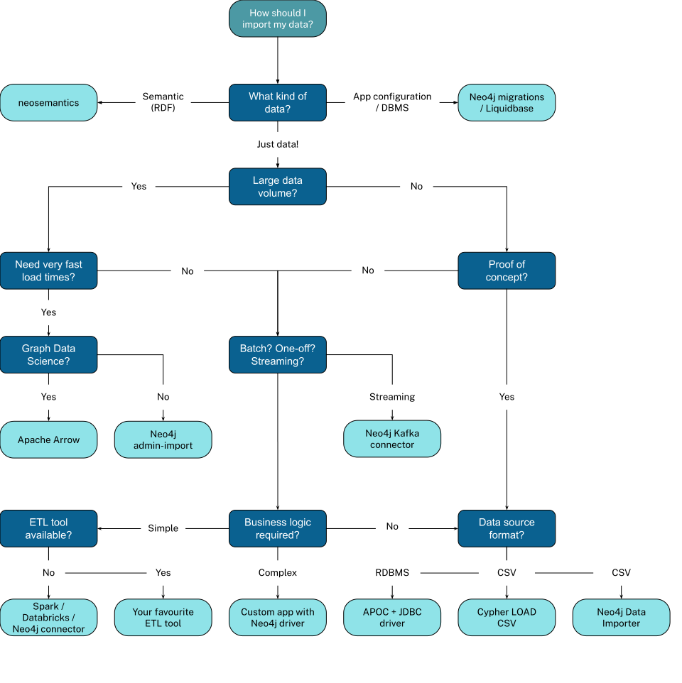

# Learning Neo4j

## Basics

Creating a node:

```cypher
CREATE (charlie:Person&Actor {name: 'Charlie Sheen'}), (oliver:Person&Director {name: 'Oliver Stone'})
```

Person&Actor means that the node is both a Person and an Actor.

Setting a label:

```cypher
MATCH (hoffa:Movie {title: 'Hoffa', tmdbId: 10410, released: '1992-12-25', imdbRating: 6.6, genres: ['Crime', 'Drama']})
SET hoffa.languages =  ['English', 'Italian', 'Latin']
```

Labels should be semanticially orthogonal, i.e. have nothing to do with each other. Additionally they should not be representing hierarchical relationships.

## Duplicate data

Movies can exist in multiple languages. Instead of having multiple language as a property where I need to match all movies (`Match (m:Movie) WHERE 'Italian' IN m.languages RETURN m.title`) I can create a node "language" and connect it to the movie. Removing a language as a list of strings from a movie is done by first matching the movie nodes, turning the list of language into sepearte rows using the `UNWIND`.

```cypher
MATCH (m:Movie)
UNWIND m.languages AS language
WITH  language, collect(m) AS movies
MERGE (l:Language {name:language})
WITH l, movies
UNWIND movies AS m
WITH l,m
MERGE (m)-[:IN_LANGUAGE]->(l);
MATCH (m:Movie)
SET m.languages = null
```

Doing the same with genres:

```cypher
MATCH (m:Movie)
UNWIND m.genres AS genre
WITH genre, COLLECT(m) AS movies
MERGE (g:Genre {name: genre})
WITH g, movies
UNWIND movies AS m
WITH g, m
MERGE (m)-[:IN_GENRE]->(g);

MATCH (m:Movie)
SET m.genres = null;
```

## Performance

### Specialized relationships

Sometimes it may make sense to change a relationship to be very specific. Consider a case where I need to filter on a specific year and that year is a property on the relationship. Instead of iterating over all relationships and checking the year I can create a new relationship with the year as part of the name (`ACTED_IN_1992`) and use that to filter. It seems redundant but the performance improvement can be large.

Creating a specialized relationship for rating:

```cypher
MATCH (n:User)-[r:RATED]->(m:Movie)
CALL apoc.merge.relationship(n,
  'RATED_' + r.rating,
  {},
  {},
  m,
  {}
) YIELD rel
RETURN COUNT(*) AS `Number of relationships added`;
```

MATCH (n:User)-[r:RATED]->(m:Movie)
CALL apoc.merge.relationship(n,
  'RATED_' + r.rating,
  {},
  {},
  m,
  {}
) YIELD rel
RETURN COUNT(*) AS `Number of relationships added`;

### Misc

For performance reasons, creating a schema index on the label or property is highly recommended **when using MERGE**.

## Intermediate Nodes

Exercise:
We add a Role node using the role property from the ACTED_IN relationship.

In this instance model we also show that some Role nodes could be related to each other with the INTERACTED_WITH relationship, but you will not implement the INTERACTED_WITH relationships.

Write and run refactor code to:

Find an actor that acted in a Movie (MATCH (a:Actor)-[r:ACTED_IN]→(m:Movie))

Create (using MERGE) a Role node setting it’s name to the role in the ACTED_IN relationship.

Create (using MERGE) the PLAYED relationship between the Actor and the Role nodes.

Create (using MERGE) the IN_MOVIE relationship between the Role and the Movie nodes.

Your code should create 5 nodes and 10 relationships.

```cypher
MATCH (a:Actor)-[r:ACTED_IN]→(m:Movie) 
MERGE (role:Role {name: r.role})
MERGE (a)-[:PLAYED]->(role)
MERGE (role)-[:IN_MOVIE]->(m)
```

## Importing data

Moving data from one database to neo4j.



## Impact of indexes on query performance

used automatically by the Cypher® planner in MATCH clauses
