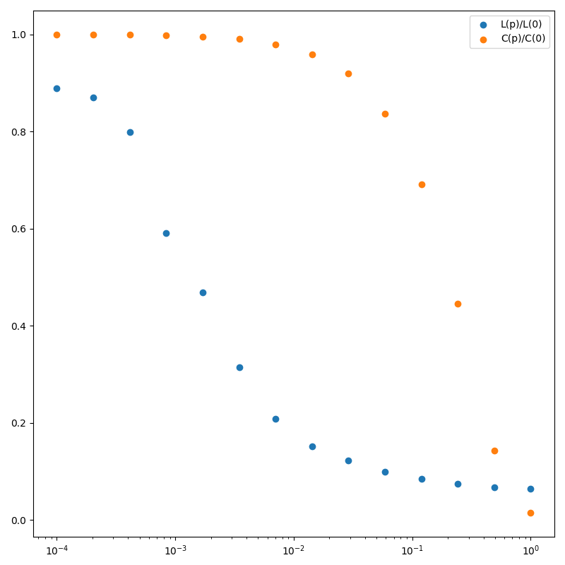

# Recreating two figures from the paper "Collective dynamics of 'small-world' networks" by Watts and Strogatz

Figure 1: The Watts-Strogatz model of a small-world network. The network is constructed by starting with a regular ring lattice and then rewiring each edge with probability p. The network is characterized by the average shortest path length L and the clustering coefficient C.

The original figure was created using 20 nodes and 4 neighbors for each node. Here, I use 10 nodes and 4 neighbors for each node.

Original figure:

Recreated figure:

Figure 2: The relationship between the clustering coefficient C and the average shortest path length L for the Watts-Strogatz model. The red line represents the original model with 20 nodes and 4 neighbors, while the blue line represents the model with 10 nodes and 4 neighbors.

Original figure:

Recreated figure:

